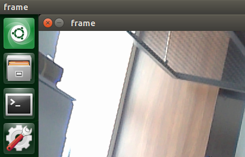

# ObjectTracker

ObjectTracker is a Python library for dealing with tracking objects on live frames(MIPI Camera) and enables features that you can select and track any object any time.

## Libraries and Installation

The libraries used in this project are [OpenCV](https://docs.opencv.org/master/d2/de6/tutorial_py_setup_in_ubuntu.html) and [pynput](https://pypi.org/project/pynput/).

```bash
sudo apt-get install python3-opencv
pip install pynput
```
## Usage
```bash
python3 objectTracking.py
```
## Functions
In this code, we have 4 thread objects running together.

### on_click Thread
The function on_click enables us to select the 2 diagonally oriented corners of our boundingBox.

### on_functionf8andf7 Thread
With the help of on_functionf8andf7, we can start determining corners of boundingBox. First corner is the last point clicked on the image before pressing F8 ; and the second corner is the next point clicked on the image after pressing F8. 

Then there is F7 button that enables us to select a new bounding box when there is a tracker on the image already. Double-clicking F7 button resets the bounding box and the first function with F8 can be repeated for creating a new tracker and tracking another object.

### coordLister Thread
This function takes the coordinates that determined by the on_click and on_functionf8andf7, and send it to boundingBox() function to create the bounding box and provides a start for the conditions in the while loop.

## Offset

You can see that there is offset in boundingBox() function, which is because of location of the video output on the screen. Upper-left corner of the video output is not at the corner of the screen, so to optimize it, adding offset according to the location of video output in your screen will work. 


Here, you can see where the video is located in my screen.


